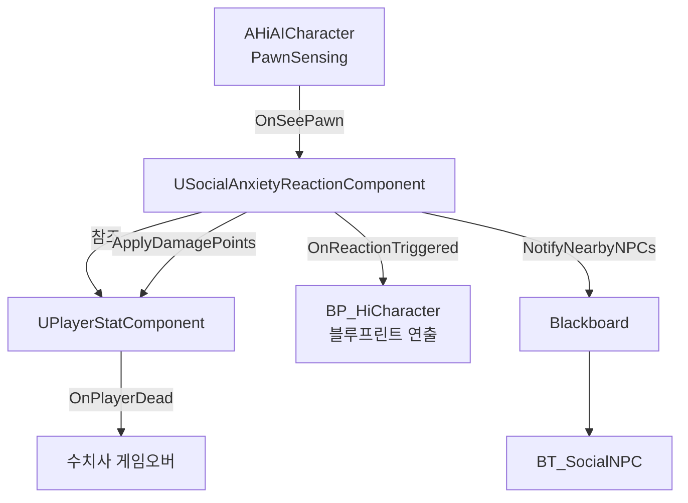
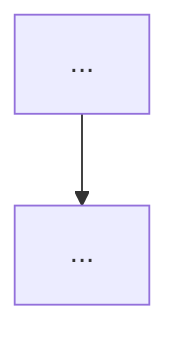
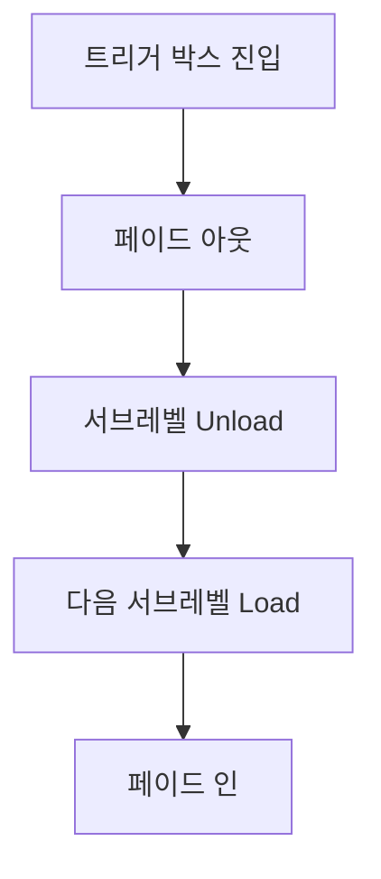

# SystemMap.md

High-level Mermaid diagrams of the project flow and ownership.

Keep diagrams high-level. Do not include every class, function, or Blueprint node.
Update this file when high-level flow, ownership, or initialization order changes.

---

## Overall System Flow

---

## UI Flow

<!-- 구현 시작 후 채운다 -->

---

## Level Transition Flow

---

## Change Log

| Date | Diagram Updated | Reason |
|------|-----------------|--------|
| 2025-06-17 | Overall Flow, Level Transition | 프로젝트 시작 |
